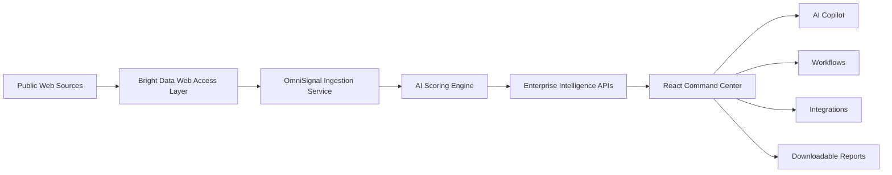

# OmniSignal AI

## Enterprise Live Web Intelligence Command Center

**OmniSignal AI** is an enterprise AI intelligence platform that turns live public web signals into risks, opportunities, savings, workflows, and executive decisions.

It demonstrates how **Bright Data-powered live web access** can become a complete enterprise decision layer for procurement, vendor risk, finance, security, compliance, revenue operations, and executive teams.

> **Bright Data unlocks public web data. OmniSignal AI turns that data into enterprise action.**

---

## Live Demo

Frontend Demo: `https://omnisignal-ai.vercel.app`  
GitHub Repository: `https://github.com/yousunlotif-bappy/omnisignal-ai`

> If a Vercel preview URL shows authorization required, use the public production deployment URL.

---

## One-Line Pitch

**OmniSignal AI converts live public web signals into enterprise intelligence, AI recommendations, workflows, and business actions.**

---

## Core Product Flow

```text
Bright Data unlocks public web data
        ↓
OmniSignal AI collects signals
        ↓
AI scores risk/opportunity impact
        ↓
Dashboard shows business intelligence
        ↓
AI Copilot explains and recommends actions
        ↓
Workflows and integrations turn insight into action
```

This is the main idea behind the project: public web data should not remain scattered, manual, and disconnected. OmniSignal AI transforms that data into structured, scored, actionable business intelligence.

---

## The Problem

Enterprise teams depend on information that changes every day across the public web.

Important signals are scattered across:

- Vendor websites
- Pricing pages
- Public RFP portals
- Security advisories
- News articles
- Competitor announcements
- Regulatory pages
- Supplier updates
- Market reports
- Public documents

These signals can affect business-critical decisions:

- A supplier may face a cybersecurity incident.
- A vendor may increase pricing before renewal.
- A competitor may launch a new product.
- A public RFP may reveal buying intent.
- A regulation may affect multiple vendors.
- SaaS or cloud waste may create savings opportunities.
- A logistics supplier may show signs of disruption.

Most enterprises discover these signals manually, too late, or across disconnected tools.

---

## The Solution

**OmniSignal AI creates a unified live web intelligence layer for enterprise decision-making.**

The system collects or receives public web signals, normalizes them into structured intelligence, scores their business impact, and routes them into:

- Executive dashboards
- Vendor risk intelligence
- Opportunity detection
- Risk and compliance monitoring
- Contract renewal intelligence
- Savings analysis
- AI Copilot answers
- Workflow automation
- Enterprise integrations
- Downloadable AI reports

OmniSignal AI helps teams move from **manual research** to **real-time intelligence and action**.

---

## Why This Project Is Useful

Enterprise teams need faster answers to questions like:

```text
Which vendors are risky right now?
Which public web signals require action?
Where can we reduce cost?
Which contracts need renewal attention?
Which competitors changed pricing?
Which public RFPs create opportunities?
What should executives know today?
```

OmniSignal AI is useful because it:

- Detects external risks earlier
- Finds savings opportunities faster
- Turns public web data into structured signals
- Gives AI-generated recommendations
- Helps executives understand what matters
- Converts insights into workflows
- Supports downloadable reports for business review
- Connects intelligence to enterprise tools

Instead of only showing data, OmniSignal AI explains what changed, why it matters, and what action should happen next.

---

## Is This a Real-World Project?

Yes. OmniSignal AI is designed as a real-world enterprise SaaS concept.

The current version is a **hackathon MVP**, but the problem and product direction are real.

Real enterprise teams already spend time monitoring:

- Vendor risk
- Supplier disruption
- Market changes
- Competitor activity
- Contract exposure
- Compliance updates
- Public RFPs
- Cost-saving opportunities

OmniSignal AI combines these needs into one command center powered by live web intelligence.

### Current MVP

The MVP includes:

- Working React frontend
- Working FastAPI backend
- Dynamic backend API data
- Bright Data-style ingestion demo
- Demo/live mode architecture
- AI Copilot endpoint
- Module-specific AI Assistant
- AI scoring and severity logic
- TXT / JSON / CSV export
- Printable PDF report export
- Workflow simulation
- Enterprise integration hub

### Production Roadmap

For production, the system can be extended with:

- Real Bright Data API credentials
- Persistent database
- Scheduled web monitoring
- Real PDF/DOC/CSV content parsing
- LLM-powered reasoning
- Source citations
- Authentication and user roles
- Audit logs
- Real Slack, Salesforce, Jira, ServiceNow, and Coupa actions
- Background workers for continuous ingestion
- Multi-tenant enterprise workspaces

---

## Target Users

OmniSignal AI is designed for enterprise teams that need to make decisions from external signals.

### Procurement Teams

Use OmniSignal AI to monitor vendor risk, contract renewals, supplier disruptions, and negotiation opportunities.

### Vendor Risk Teams

Track third-party exposure, supplier issues, cybersecurity incidents, and public risk signals.

### Finance / FinOps Teams

Identify cloud waste, SaaS license waste, renewal savings, and contract optimization opportunities.

### Security Teams

Monitor supplier cybersecurity incidents, third-party exposure, and critical alerts.

### Compliance Teams

Track regulatory changes, audit gaps, policy risks, and vendor compliance impact.

### Revenue / GTM Teams

Detect public RFPs, buying intent, market movement, and high-confidence opportunities.

### Executives

Use the Command Center and AI Copilot to get fast summaries, recommended actions, and decision priorities.

---

## Key Features

### 1. Command Center

The Command Center is the executive intelligence hub.

It shows active signals, pipeline value, vendor risk, competitor moves, renewals at risk, savings identified, Bright Data demo mode, live web pipeline, intelligence feed, risk matrix, signal severity chart, opportunity value chart, and executive AI brief.

### 2. Bright Data Web Intelligence Pipeline

The Bright Data pipeline demonstrates how live public web access powers the system.

Supported Bright Data-style tools:

- SERP API
- Web Unlocker
- Web Scraper API
- Scraping Browser
- MCP Server

The project supports a demo/live architecture:

```text
Demo Mode:
Simulates Bright Data-powered public web intelligence collection.

Live Mode:
Prepared for real Bright Data credentials through environment variables.
```

Example environment variables:

```env
BRIGHT_DATA_MODE=demo
BRIGHT_DATA_API_KEY=your_bright_data_api_key_here
BRIGHT_DATA_SERP_ENDPOINT=https://api.brightdata.com/request
BRIGHT_DATA_WEB_UNLOCKER_ZONE=your_web_unlocker_zone
BRIGHT_DATA_BROWSER_ZONE=your_scraping_browser_zone
```

### 3. Signals Intel

Signals Intel converts public web events into structured enterprise signals with signal type, impact score, likelihood, confidence, severity, status, and source URL.

### 4. Vendor Risk Intelligence

The Vendors module helps teams monitor critical vendors, high-risk suppliers, security exposure, pricing volatility, logistics delays, supplier disruption, and public vendor alerts.

### 5. Opportunities

The Opportunities module detects public RFPs, AI infrastructure buying intent, enterprise account signals, alternative vendor sourcing, contract renegotiation, and cloud optimization opportunities.

### 6. Risk & Compliance

Risk & Compliance helps teams monitor regulatory updates, policy changes, audit gaps, compliance exposure, vendor obligations, and critical risk alerts.

### 7. Markets & Competitors

This module tracks competitor product launches, pricing changes, market positioning, strategic announcements, AI product movement, and competitive threats.

### 8. Contracts & Renewals

This module tracks upcoming renewals, renewal windows, contract value at risk, negotiation leverage, vendor risk before renewal, and savings opportunities.

### 9. Savings Analyzer

Savings Analyzer identifies cloud waste, SaaS license underutilization, duplicate tools, unused seats, renewal savings, and support plan optimization.

### 10. AI Copilot

AI Copilot answers enterprise intelligence questions using signals, vendors, opportunities, alerts, and Bright Data ingestion context.

Example questions:

```text
Give me an executive summary.
What are the top vendor risks right now?
Which opportunities should we prioritize this week?
Where can we reduce cost?
What alerts require immediate attention?
```

The Copilot returns executive answers, recommended actions, confidence score, sources used, and context used.

### 11. Module AI Assistant

Most modules include their own AI Assistant panel.

Supported inputs:

- Text
- URL
- Website
- Company name
- Manual note
- PDF reference
- DOC reference
- CSV reference
- JSON reference

AI output includes summary, score, severity, confidence, recommended actions, and full report.

Export options:

- TXT
- JSON
- CSV
- Printable PDF report

Enterprise actions:

- Add to Decision Queue
- Create Workflow
- Copy Report

### 12. Workflows

The Workflows module shows how intelligence becomes business action, including Vendor Risk Review, Bright Data Signal Triage, Opportunity Qualification, Contract Renewal Watch, and Executive Brief Generator.

### 13. Integrations

The Integrations module demonstrates enterprise readiness with Bright Data, Salesforce, Slack, ServiceNow, Jira, Snowflake, Microsoft Teams, and Coupa.

---

## Architecture



---

## Technical Architecture

```text
Frontend:
React + TypeScript + Tailwind CSS

Backend:
FastAPI + Python + Pydantic + Uvicorn

Intelligence Layer:
Signal normalization
Risk/opportunity scoring
Module-specific AI analysis
Bright Data-style ingestion service
AI Copilot endpoint

Output Layer:
Dashboard modules
Workflow simulation
Enterprise integrations
TXT / JSON / CSV / PDF-style report export
```

---

## API Routes

### Core Intelligence APIs

```text
GET /signals/
GET /vendors/
GET /opportunities/
GET /alerts/
```

### Bright Data Ingestion APIs

```text
GET /ingestion/status
POST /ingestion/run-demo
```

### AI Copilot API

```text
POST /copilot/query
```

Example request:

```json
{
  "question": "Give me an executive summary"
}
```

### Module AI Analyzer API

```text
POST /module/analyze
```

Example request:

```json
{
  "module": "Vendors",
  "input_type": "Text",
  "content": "CloudNova Systems reported a critical security incident and possible service disruption.",
  "file_name": null
}
```

---

## Local Setup

### 1. Clone the Repository

```bash
git clone https://github.com/yousunlotif-bappy/omnisignal-ai.git
cd omnisignal-ai
```

### 2. Run Backend

```bash
cd backend
pip install -r requirements.txt
python -m uvicorn app.main:app --reload
```

Backend:

```text
http://127.0.0.1:8000
```

API docs:

```text
http://127.0.0.1:8000/docs
```

### 3. Run Frontend

```bash
cd frontend
npm install
npm start
```

Frontend:

```text
http://localhost:3000
```

---

## Environment Variables

### Backend `.env.example`

```env
BRIGHT_DATA_MODE=demo
BRIGHT_DATA_API_KEY=your_bright_data_api_key_here
BRIGHT_DATA_SERP_ENDPOINT=https://api.brightdata.com/request
BRIGHT_DATA_WEB_UNLOCKER_ZONE=your_web_unlocker_zone
BRIGHT_DATA_BROWSER_ZONE=your_scraping_browser_zone
```

### Frontend `.env.example`

```env
REACT_APP_API_BASE_URL=http://127.0.0.1:8000
```

For deployment:

```env
REACT_APP_API_BASE_URL=https://your-backend-url.onrender.com
```

---

## Demo Flow for Judges

Recommended 2-3 minute demo:

```text
1. Open Command Center
2. Show enterprise KPIs
3. Click Run Web Data Demo / Run Bright Data Demo
4. Show Bright Data web signals collected
5. Open Sources page
6. Show ingestion pipeline and Bright Data tools
7. Open Signals Intel
8. Analyze a sample signal using Module AI Assistant
9. Export JSON or PDF report
10. Open Vendors
11. Show high-risk vendor intelligence
12. Open AI Copilot
13. Ask: Give me an executive summary
14. Show recommended actions and sources used
15. Quickly show Workflows and Integrations
```

Best demo question:

```text
Give me an executive summary.
```

Best sample AI input:

```text
CloudNova Systems reported a critical security incident and possible service disruption.
```

---

## Screenshots

Create a `screenshots/` folder and add:

```text
screenshots/command-center.png
screenshots/sources-pipeline.png
screenshots/signals-intel.png
screenshots/ai-copilot.png
screenshots/workflows.png
screenshots/integrations.png
```

Then add:

```md
### Command Center


### Bright Data Pipeline


### Signals Intel


### AI Copilot


### Workflows


### Integrations

```

---

## Competitive Differentiation

Many existing tools focus on only one category:

- Market intelligence
- Supplier risk
- Competitive intelligence
- Cyber risk
- Web scraping infrastructure

OmniSignal AI demonstrates a unified enterprise intelligence layer:

```text
Live web data
+ Bright Data-style ingestion
+ AI scoring
+ vendor risk
+ opportunities
+ contracts
+ savings
+ workflows
+ integrations
+ AI Copilot
+ downloadable reports
```

The core difference is that OmniSignal AI does not only collect data. It converts public web signals into enterprise decisions and actions.

---

## Why This Can Become a Real Product

OmniSignal AI has real-world potential because enterprise teams already need external intelligence for procurement decisions, vendor risk monitoring, cost optimization, contract negotiation, compliance tracking, revenue opportunities, competitive intelligence, and executive reporting.

The strongest first market wedge is:

> **AI web intelligence for vendor risk and procurement savings.**

From there, the platform can expand into revenue intelligence, compliance monitoring, market intelligence, and executive decision automation.

---

## Hackathon Relevance

This project directly aligns with the idea of AI agents powered by real-time web access.

It shows how web data can move through a complete enterprise workflow:

```text
Bright Data unlocks public web data
        ↓
OmniSignal AI collects signals
        ↓
AI scores risk/opportunity impact
        ↓
Dashboard shows business intelligence
        ↓
AI Copilot explains and recommends actions
        ↓
Workflows and integrations turn insight into action
```

---

## Current MVP Status

Implemented:

- React enterprise dashboard
- FastAPI backend
- Dynamic API data
- Bright Data demo ingestion layer
- Demo/live mode structure
- AI Copilot endpoint
- Module-specific AI Assistant
- AI scoring and severity logic
- TXT / JSON / CSV export
- Printable PDF report export
- Workflow simulation
- Integration hub
- Vendor risk intelligence
- Opportunity intelligence
- Risk and compliance interface
- Contract renewal intelligence
- Savings analyzer
- Command Center charts
- Bright Data demo banner

---

## Production Roadmap

Next steps:

- Connect real Bright Data API credentials
- Add persistent database
- Add real PDF/DOC/CSV parsing
- Add LLM-powered reasoning
- Add scheduled ingestion jobs
- Add authentication and user roles
- Add audit logs
- Add real Slack, Salesforce, Jira, ServiceNow, and Coupa actions
- Add source citations
- Add alert notifications
- Add multi-tenant workspaces

---

## Final Tagline

**All enterprise signals. One AI command center.**

Alternative:

**From live web signals to enterprise action.**

---

## License

This project is currently built for hackathon and demo purposes.
